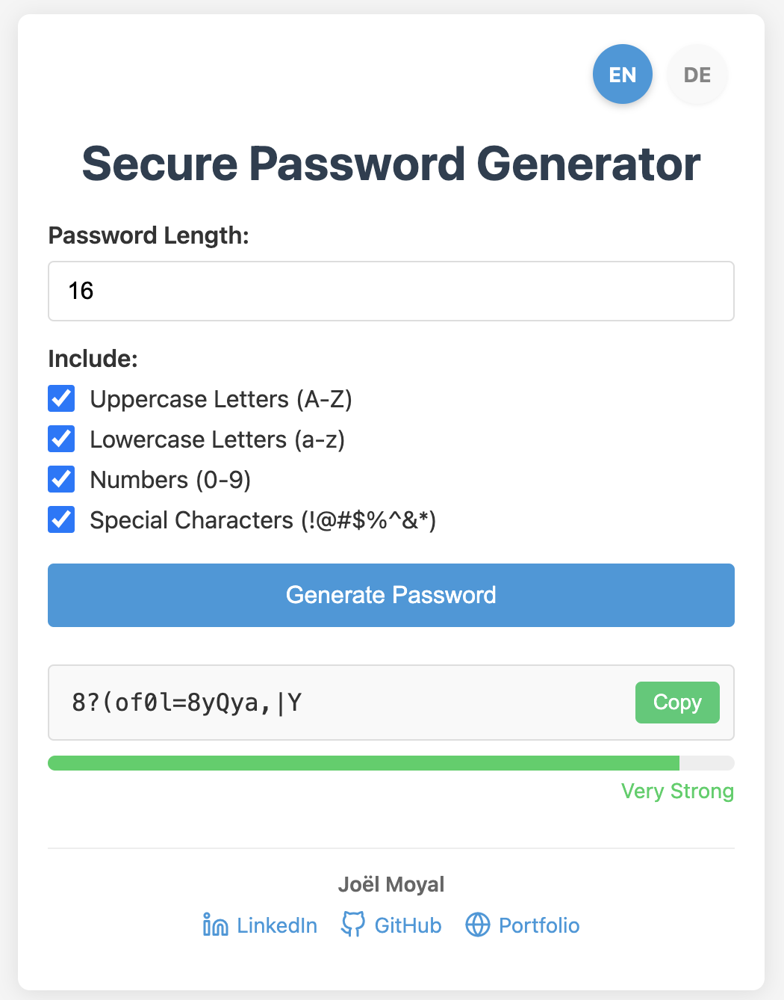

# Secure Password Generator

A modern, multilingual, client-side password generator that creates strong, secure passwords with customizable options.



## 🌟 Features

- **Strong Password Generation**: Create secure passwords with customizable length and character sets
- **Multilingual Support**: Available in 2 languages:
  - 🇺🇸 English
  - 🇩🇪 German
- **Password Strength Meter**: Visual indicator of password security
- **Copy to Clipboard**: One-click copying for easy use
- **Client-Side Only**: All password generation happens in your browser - no data is sent to any server
- **Mobile Responsive**: Works seamlessly on all device sizes
- **Customization Options**:
  - Uppercase letters (A-Z)
  - Lowercase letters (a-z)
  - Numbers (0-9)
  - Special characters (!@#$%^&*)

## 🚀 Demo

Try the live demo: [Secure Password Generator](https://your-username.github.io/password-generator/)

## 💻 Technologies Used

- HTML5
- CSS3
- JavaScript (Vanilla)
- CSS Grid & Flexbox
- Mobile-first responsive design

## 📋 How to Use

1. Select your preferred language from the language toggles
2. Set the desired password length (8-128 characters)
3. Choose which types of characters to include
4. Click "Generate Password"
5. Copy your new secure password with the copy button

## 🛠️ Installation

To run this project locally:

```bash
# Clone the repository
git clone https://github.com/your-username/password-generator.git

# Navigate to the project folder
cd password-generator

# Open the HTML file in your browser
open index.html  # on macOS
# or
start index.html  # on Windows
```

No build process or dependencies required!

## 🔒 Security

- All password generation happens in the browser
- No passwords are stored or transmitted
- Uses cryptographically secure random number generation
- Enforces minimum security standards (8+ characters, mixed character types)

## 🌐 Internationalization

The password generator supports two languages with proper translations for all elements:

- English (default)
- German

To add additional languages, modify the `translations` object in the JavaScript code.

## 📱 Mobile Support

The interface is fully responsive and optimized for:
- Desktop browsers
- Tablets
- Mobile phones
- Touch interfaces

## 🤝 Contributing

Contributions are welcome! Here's how you can help:

1. Fork the repository
2. Create a feature branch: `git checkout -b new-feature`
3. Make your changes
4. Commit your changes: `git commit -m 'Add some feature'`
5. Push to the branch: `git push origin new-feature`
6. Submit a pull request

### Ideas for Contributions

- Add more languages
- Implement additional password strength rules
- Add password pattern options (pronounceable, memorable, etc.)
- Create a browser extension version

## 📄 License

This project is licensed under the MIT License - see the [LICENSE](LICENSE) file for details.

## 👤 Author

Joël Moyal

- LinkedIn: [Joël Moyal](https://www.linkedin.com/in/joel-moyal)
- GitHub: [joelmoyal](https://github.com/joelmoyal)
- Website: [joelmoyal.com](https://joelmoyal.com)

## 🙏 Acknowledgments

- Icons provided by [Lucide Icons](https://lucide.dev/)
- Language selection inspired by various multilingual applications
- Password strength algorithm based on common security best practices